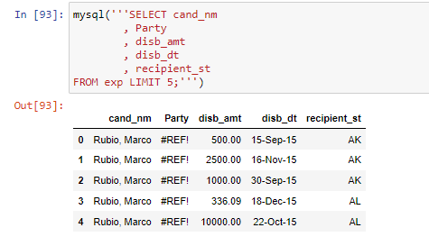
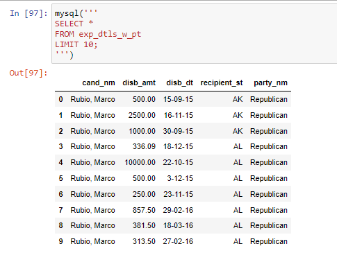
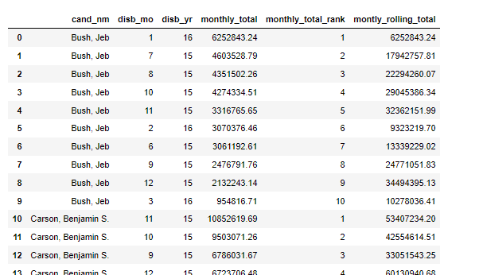

# 2016 Presidential Candidate Spending Overview - SQL table transformation
Goals: 
1. Add Party data back to the dataset by using google searches
2. Transform the table by using joins, aggregate and windows functions.

Structures ([see jupyter notebook]('./2016-presidential-candidates-spending.ipynb')):
1. Data Exploration
2. Data Wrangling
3. Table Transformation
* data wrangling by adding back Party data for each candidate 
Before - missing canndidate party data in column Paty, wrong data format in column dist_dt

After - anndidate party data, data format corrected

* table transformation: added rolling total and rank columns

Language: Python, SQL
Tools: pandsql, googlesearch  
Data: 2016 Presidential Candidate Spending, records are as of mid May 2016. Data downloaded [here](https://public.tableau.com/en-us/s/resources) and originally comes from the Federal Election Commission. 
